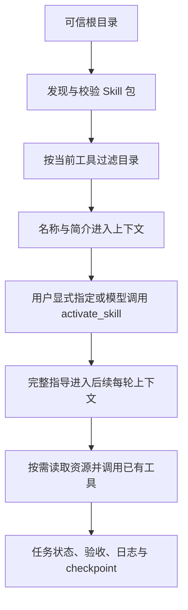

# 可插拔 Skill 系统设计

设计开始：2026-10-09。实现与验证：2026-10-10。当前版本：v1。实现入口：`core/skills.py`。

## 1. 为什么需要 Skill

Agent 已有模型、工具注册表、执行器、环境适配器、任务记忆与恢复机制。工具使其能够读文件、运行命令和操作桌面，
但“能操作”不代表知道某类任务应该如何组织、处理异常、核对结果并交付。

Skill 把操作经验、业务约定、参考资料、模板与辅助脚本组织成可维护的任务知识包。例如：浏览器 Skill 描述观察、等待和验证方法，
订单 Skill 描述字段、去重和金额核对规则。模型在需要时加载这些知识，结合已有工具完成任务。

Skill 不训练模型参数，不自动形成长期记忆，不提供新的执行权限，也不会仅因写了步骤就保证模型严格遵守。
必须成立的约束由 Runtime 和工具实现，例如参数校验、动作状态、验收和禁止重放未决副作用。

| 组件 | 职责 |
| --- | --- |
| Model | 理解目标，规划并选择下一步 |
| Tool | 执行具体动作或查询 |
| MCP | 连接外部工具服务；本次尚未接入 |
| Skill | 任务方法、领域知识、参考资源与交付约定 |
| TaskMemory / checkpoint | 当前任务事实、进度、动作结果和恢复依据 |
| 确定性工作流 | 程序保证的步骤、分支和检查 |

## 2. 目标与第一版范围

增加或删除符合约定的本地 Skill 目录，不修改 Agent 核心循环即可使用或移除任务指导。
第一版提供发现、校验、目录展示、模型选择和用户显式选择、按任务激活与停用、资源分页读取、上下文保留、包版本核对和执行事件。

本次未包含远程市场、自动下载安装、网络资源读取、MCP 客户端、Playwriter、浏览器扩展、独立 Skill 管理界面、
脚本运行沙箱、自动生成 Skill 和自动效果评估。目录中的脚本不会在发现或激活时执行。

已有单 Agent Loop 继续负责执行；Skill 不需要单独的 Agent 或新模型请求来进行路由。

## 3. 格式与文件组织

采用 Agent Skills 的 `SKILL.md` + YAML frontmatter + Markdown 正文的基本结构，支持可选资源目录。

```text
.agents/skills/
└── complex-task/
    ├── SKILL.md
    └── references/
        └── acceptance.md
```

```yaml
---
name: complex-task
description: 处理多阶段、需要保存进度并独立验收的复杂任务；简单问答不适用。
compatibility: 需要启用长任务模式。
metadata:
  version: "1.0.0"
  nitty-required-tools: "task_plan task_progress task_verify"
---
```

正文放在第二个 `---` 后面。每个 Skill 应说明适用和不适用场景、前置条件、执行与分支、异常处理、输出要求和验收证据。
短正文描述主流程，长资料放 `references/`，模板放 `assets/`，可选辅助代码放 `scripts/`。

字段规则：

- `name`：与目录同名，1～64 字符，仅小写英文字母、数字和单连字符。
- `description`：1～1024 字符；用于选择 Skill，应明确用途与触发条件，避免“处理所有任务”。
- `compatibility`：可选，不超过 500 字符；人类可读的环境说明，不自动安装任何依赖。
- `metadata`：字符串键值映射；`version` 应使用引号。缺省版本显示 `unversioned`，内容哈希始终参与核对。
- `metadata.nitty-required-tools`：本项目扩展，用空白或逗号分隔需要的工具名称。依赖必须真实存在于当前工具注册表。

未知字段不作为程序权限或执行指令使用；例如 `allowed-tools` 不会自动授权。第一版不宣称实现所有其他客户端扩展字段。
YAML 使用安全解析器，拒绝重复键、不可解析的格式和危险对象标签。损坏的单个包被排除并记录诊断，其他包可继续使用。

## 4. 目录配置、信任与优先级

默认按顺序扫描：

1. 用户目录 `~/.nitty-agent/skills`（运行账户没有 home 时略过）。
2. 本项目根目录 `.agents/skills`，与任务 `workdir` 无关。
3. `NITTY_SKILL_DIRS` 配置的额外根目录，按数组顺序。

后面的根目录覆盖前面的同名 Skill，记录 `SKILL_SHADOWED`。高优先级同名包损坏时，不悄悄回退到旧版本。
每个根目录只扫描一级 Skill 子目录；不遍历整台电脑或任意任务工作目录。添加根目录意味着将其中的 Skill 作为可信任务指导。
不会把下载文件、网页或工具输出中出现的 `SKILL.md` 自动提升为可信指导。

`.env` 示例：

```dotenv
NITTY_SKILL_DIRS=["C:/Users/wangy/my-agent-skills"]
NITTY_DISABLED_SKILLS=["some-skill"]
```

两个变量必须是 JSON 字符串数组，额外根目录必须是绝对路径。禁用按名称生效，所有来源的同名包均排除。
修改 `.env` 后重启服务。目录内容在每次新 Run 时重新发现，连续 CLI 会话也能在下一次任务使用新文件。
进行中的 Run 保持发现时的正文快照；包修改不会热替换已加载指导。

## 5. 从发现到执行



发现时读取正文并为包内文件计算哈希，固定本 Run 的包快照；资源的字节读取用于完整性核对，不会把所有资源内容送给模型。
模型最初只看到名称与简介，选择后才收到正文，参考资料只在调用读取工具时进入上下文。

没有可用 Skill 时不显示空目录，不注册 Skill 控制工具。缺少工具依赖的 Skill 不出现在自动选择目录中，
日志说明缺少什么；用户显式指定时返回明确错误。工具依赖是当前可用性的声明，不是完整的效果保证。

用户显式指定使用任务开头的独立行：

```text
/skill complex-task
整理工作目录中的资料，生成结果并核对数量。
```

可在开头连续指定多个 `/skill name` 行。名称不存在、已禁用、包无效或缺少依赖时，在调用模型前报错。
普通任务依靠模型阅读目录后选择。脚本中的 `$变量` 不作为 Skill 触发语法。

第一版没有专门的选择模型和向量检索；数量较少时直接展示有界目录，避免引入额外路由成本与误筛。
Skill 多到超过预算时显式报错，后续再考虑候选检索与用户范围选择。

## 6. 模块与接口

| 模块 | 职责与边界 |
| --- | --- |
| `SkillCatalog` | 根目录扫描、安全 YAML、包清单和哈希、覆盖与禁用、格式诊断 |
| `SkillManager` | 按 Run 准备、依赖检查、激活/停用、资源读取、恢复核对、上下文构建和事件 |
| `ToolRegistry` | 注册 Skill 工具；新任务重建时允许撤销本管理器注册的工具，不覆盖同名业务工具 |
| `AgentState` | `active_skills`、`skill_resources` 和瞬时 `skill_context` |
| `ContextBuilder` | 将本轮 `skill_context` 与既有运行规则、工具规则、任务状态一起提供给模型 |
| `checkpoint` | 保存激活身份与资源哈希，不保存 Skill 正文和资源内容 |
| `bootstrap` | CLI 和 Web 共用相同配置与管理器装配 |

`Agent(..., skills=SkillManager(...))` 为 Python 调用方提供可选注入；直接构造 Agent 时不传 `skills`，保持原有无 Skill 行为。
CLI 与 Web 通过 `bootstrap.agent_session()` 自动启用。没有增加 API 请求字段和数据库迁移，前端事件仍可通过现有通用时间线查看。

控制工具：

| 工具 | 参数 | 行为 |
| --- | --- | --- |
| `activate_skill` | `name` | 核对包未变化，激活并返回身份和资源目录；正文由下一轮上下文提供 |
| `read_skill_resource` | `name`, `path`, `offset=0`, `limit=12000` | 读取已激活包内 UTF-8 资源，校验哈希，按字符分页 |
| `deactivate_skill` | `name` | 移除本 Run 的指导与资源访问记录，不撤销已有操作 |

名称参数的枚举来自当前可用目录，工具处理函数仍验证状态与依赖。激活/停用要求单独一轮调用；
与其他动作混在同批时整批拒绝，以确保模型先收到完整新指导，再决定实际操作。

激活结果不重复返回正文，避免一份指导同时出现在系统上下文与工具历史中。重复激活幂等，不重复插入指导或激活事件。
资源返回 `content`、`total_chars`、`offset`、`truncated` 和 `next_offset`，明确分页状态。

## 7. 上下文生命周期与冲突

激活属于当前 Run，每次新任务重新选择。历史会话可保留过去的激活反馈，但不自动激活旧 Skill。
当前正文放在独立的 `skill_context` 中，每轮根据激活记录重建，不依赖普通历史消息，因此历史裁剪和摘要不会删除活跃指导。
阶段不再需要时可调用 `deactivate_skill`；历史资源内容可能仍在普通会话中，停用不等于擦除历史。

用户当前目标与框架运行规则优先；Skill 是特定任务的方法指导，不能扩大授权或覆盖工具规则。
多个 Skill 的说明若产生无法兼容的业务要求，模型需要选择适用指导或请求缺少的信息；第一版不提供自然语言冲突的确定性检测。

正文与目录预算独立于已有历史预算，第一版使用字符/字节上限，不是精确 token 计数。
超出时返回明确错误，不静默截掉正文尾部。自定义 ContextBuilder 若覆盖消息构建方法，需要显式处理 `state.skill_context`。

## 8. 资源与脚本边界

资源路径相对于 Skill 所在目录，拒绝绝对路径、越界路径、符号链接、目录联接和不在发现清单中的新文件。
参考文件内容必须与快照哈希一致。二进制模板可以包含在包清单中，但文本读取工具返回明确错误，不尝试解码或执行。

脚本只是资源；读取脚本不会运行它。执行需要 Agent 使用已经存在并允许的 Shell 等工具。
Skill 系统不会自动 import Python 模块、运行安装脚本或注册脚本为可执行工具。

资源接口的路径边界不等于整个 Agent 的沙箱。既有 `exec_command` 和文件工具仍遵循原来的范围；
直接执行脚本时，资源接口无法保证 Shell 读取的文件仍是原版本，也无法抵御本机并发恶意修改。
需要强执行隔离或脚本完整性保证时，应增加专门脚本执行适配器、执行前哈希核对和运行环境约束。

## 9. 版本与中断恢复

每个包的哈希由 `SKILL.md` 和包内资源的相对路径及 SHA-256 汇总生成。即使作者忘记升级版本号，内容变化仍能检测。
包内参考资料变化也会改变包哈希；第一版保守地核对整个包，包括尚未读取的资源。

checkpoint 增加独立的可选片段：

```json
{
  "skills": {
    "schema_version": 1,
    "active": [
      {"name": "complex-task", "version": "1.0.0", "location": "绝对的 SKILL.md 路径", "sha256": "包哈希"}
    ],
    "resources": [
      {"skill": "complex-task", "path": "references/acceptance.md", "sha256": "文件哈希"}
    ]
  }
}
```

快照中的列表与内存状态深拷贝，之后停用不会改变已生成的旧快照。旧 checkpoint 没有此片段时按空 Skill 状态读取，保持主格式版本 1。
恢复时先重新发现，再核对来源路径、版本、包哈希、依赖和资源记录，之后才调用模型或发送新动作。
变更、删除、禁用或来源被覆盖时，明确停止；恢复原包和配置后可以再次恢复，或开始新任务采用新版。
没有 SkillManager 的 Runtime 不能恢复带激活记录的任务。

恢复 Skill 只恢复任务指导。任务进度和未决动作仍由已有 TaskMemory 负责；未来浏览器连接、页面对象和 Playwriter 状态需要另外核实与重建。
部署路径变化也会触发来源不匹配；第一版不自动迁移 Skill 身份。

## 10. 限额、错误与可观察性

| 范围 | v1 上限 |
| --- | --- |
| 根目录候选 Skill 总数 | 100 |
| 根目录扫描条目 | 2000 |
| 单个 SKILL.md | 32000 字节 |
| 单个资源 | 256000 字节 |
| 包文件数，包含 SKILL.md | 100 |
| 包内容总量 | 2000000 字节 |
| 资源目录 | 最多 100 个，深度最多五层，单层最多 200 项 |
| 可用目录 JSON | 24000 字符 |
| 同时激活 | 8 个 |
| 活跃正文合计 | 40000 字符 |
| 单次资源读取 | 最多 12000 字符，可分页 |

跳过 `.git`、`node_modules`、`__pycache__` 和 `.pyc`。这些排除目录不属于包快照，不应被 Skill 当作依赖资源。

主要事件：`skills_discovered`、`skill_diagnostic`、`skill_unavailable`、`skill_activated`、`skill_deactivated`、
`skill_resource_read`、`skill_restored`。`skills_discovered.tools` 是准备后的完整工具列表；`run_started.tools` 是准备前的列表。
记录身份、来源、哈希和选择原因，不在专门 Skill 事件中复制正文。资源内容仍可能作为既有工具反馈进入本地日志与历史，勿放无关密钥。

主要拒绝包括 `SKILL_NOT_FOUND`、`SKILL_DEPENDENCY_MISSING`、`SKILL_CHANGED`、`SKILL_VERSION_MISMATCH`、
`SKILL_CONTEXT_LIMIT`、`SKILL_CATALOG_LIMIT`、`SKILL_RESOURCE_PATH`、`SKILL_RESOURCE_CHANGED`、`SKILL_RESOURCE_BINARY`。
模型触发的错误走现有 Observation；显式激活或恢复错误在进入模型循环前停止。

## 11. 使用与验收

安装项目依赖：

```powershell
conda run -n agent python -m pip install -r requirements.txt
```

示例 Skill 位于 `.agents/skills/complex-task`，依赖长任务工具：

```powershell
conda run --no-capture-output -n agent python main.py --long-horizon --skill complex-task --chat
```

CLI 的 `input()` 每次接收一行；`--skill complex-task` 会由入口为每次新任务添加对应指令，可重复传入多个 Skill。
省略 `--skill` 则由模型按需选择。`--resume` 使用快照中的原始 Skill，不能同时传 `--skill`。
Web 可使用上述 `/skill` 多行示例并启用“长任务模式”；Python 可通过 `agent.run("/skill complex-task\n任务说明")` 调用。
PyCharm 配置已有 Conda `agent` 解释器，运行 `main.py` 时添加 `--long-horizon --skill complex-task --chat`，或直接运行 `web.py`。

Python 装配示例：

```python
from pathlib import Path
from core.agent import Agent
from core.skills import SkillCatalog, SkillManager

skills = SkillManager(SkillCatalog([Path("C:/Users/wangy/my-agent-skills")]))
agent = Agent(model, registry, environment, skills=skills, long_horizon=True)
agent.run("/skill complex-task\n整理资料并核对结果。")
```

其中 `model`、`registry` 和 `environment` 使用项目已有实现，目录中需实际存在 `complex-task` 包。
不同 Skill 声明自己的真实依赖，不要给简单任务强制启用所有能力。

自动验证重点是行为：选择后下一轮出现完整指导、激活与外部动作不能混批、历史裁剪后指导仍在、新 Run 不继承、
目录刷新与禁用、资源分页/越界/变更、包版本恢复、旧快照兼容、预算与损坏包处理。
真实模型能否正确选 Skill、是否改善复杂任务成功率，需要后续在代表性任务上另行评估，本次离线替身测试不能证明这些效果。

## 12. 后续迭代顺序

1. 接入 Playwriter/MCP：新增浏览器能力适配器，明确会话、超时、取消、截图和恢复边界，再添加浏览器 Skill。
2. 增加实际任务评测：相同任务对比启用/禁用 Skill 的结果、步骤遗漏、重复操作与验证证据。
3. 完善管理入口：目录诊断、可用/缺少依赖、启用/禁用和显式选择；保持 API、前端类型与文档同步。
4. 根据数量与上下文数据再增加候选检索、精确 token 预算或会话内容缓存，避免先引入未证实必要的复杂度。
5. 若要自动运行包内脚本，单独设计执行协议及环境隔离，不能把说明文件直接变成自动执行插件。

每次重大改动应更新本设计、增加 `docs/changes/` 记录，并在 `docs/README.md` 建立链接。

## 参考

- [Agent Skills 概述](https://agentskills.io/home)
- [Agent Skills 格式](https://agentskills.io/specification)
- [Agent 接入指南](https://agentskills.io/client-implementation/adding-skills-support)

上述资料用于格式与渐进加载概念参考。限额、依赖字段、显式语法、整包哈希和按 Run 生命周期是本项目的具体设计。
